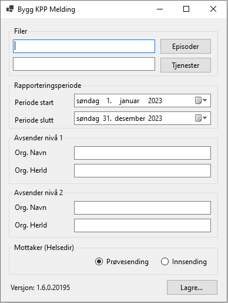

# Hvordan bruke KppParser-programmet

## Nedlasting

Før du kan bruke KppParser-programmet må du laste det ned.

1. Gå til [Releases](https://github.com/folkehelseinstituttet/KppParser/releases/)
2. Finn riktig **Release** (versjon/utgave) av programmet
3. Under **Assets**, finn `zip-filen` for det programmet du ønsker å kjøre
    - `KppParser-Gui.zip` lar deg bruke programmet via et brukergrensesnitt
    - `KppParser-ConsoleApp.zip` lar deg kjøre programmet som en konsollapplikasjon
4. Last ned ønsket `zip`-fil

## Utpakking av zip-filen

Pakk ut `zip`-filen:

1. Høyreklikk på filen &rarr; velg `Pakk ut alle...`
2. Velg ønsket mappe for hvor du vil at programmet/applikasjonen skal være lagret på datamaskinen
3. Velg `Pakk ut`

## Kjøring av programmet

### Kjøring av GUI-applikasjonen

1. Start programmet:
   - Åpne mappen som ble pakket ut
   - Finn `exe`-filen og dobbeltklikk på denne for å starte programmet
2. Fyll ut nødvendig informasjon:
   - Trykk på `Episoder` for å åpne filutforsker og velge `csv`-fil for episoder
   - Trykk på `Tjenester` for å åpne filutforsker og velge `csv`-fil for tjenester
   - Velg riktig rapporteringsperiode (hvilken datoperiode som dataene gjelder for)
     - Du kan enten bruke kalenderikonet for å velge dato, eller klikke i dato-/måned-/årsfeltet og bruke piltastene (opp/ned) for å justere start- og sluttperioden
   - Angi navn og HER-ID på avsender (nivå 1)
   - Angi navn og HER-ID på avsender (nivå 2)
   - Velg om sendingen er en ordentlig innsending eller en prøvesending
3. Generér melding (`xml`-fil):
   - Trykk `Lagre...`
   - Velg hvilken mappe du ønsker at den genererte meldingen (`xml`-fil) skal lagres i, samt ønsket navn på filen
   - Etter at du har trykket `Lagre` vil fremdriften vises i et lite vindu. Når vinduet viser `Ferdig` er filen ferdig generert. 

Programmet/Applikasjonen ser slik ut:

### Kjøring av konsollapplikasjonen

Ikke beskrevet enda.
