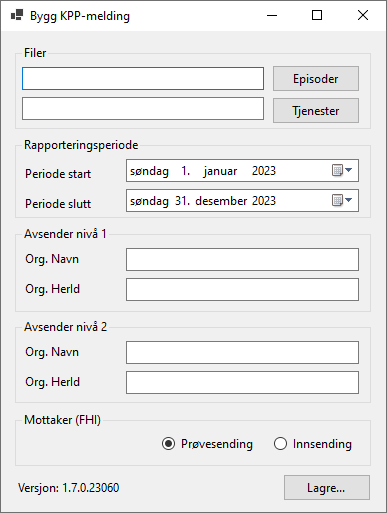

# Hvordan bruke KppParser-programmet

## Nedlasting

Før du kan bruke KppParser-programmet må du laste det ned.

1. Gå til [Releases](https://github.com/folkehelseinstituttet/KppParser/releases/)
2. Finn riktig **Release** (versjon/utgave) av programmet
3. Under **Assets**, finn `zip-filen` for det programmet du ønsker å kjøre
    - `KppParser-Gui.zip` lar deg bruke programmet via et brukergrensesnitt
    - `KppParser-ConsoleApp.zip` lar deg kjøre programmet som en konsollapplikasjon
4. Last ned ønsket `zip`-fil

## Kjøring av programmet

1. Åpne mappen der `zip`-filen ble lagret
2. Flytt eventuent `zip`-filen til en annen mappe på datamaskinen
3. Pakk ut `zip`-filen

### Kjøring av GUI-applikasjonen

1. Åpne mappen som ble pakket ut
2. Finn `exe`-filen og dobbeltklikk på denne for å starte programmet
3. Trykk på `Episoder` for å åpne filutforsker og velge `csv`-fil for episoder
4. Trykk på `Tjenester` for å åpne filutforsker og velge `csv`-fil for tjenester
5. Velg riktig rapporteringsperiode. (Hvilken datoperiode gjelder dataene for?)
   - Du kan enten bruke kalenderikonet for å velge dato, eller klikke i dato-/måned-/årsfeltet og bruke piltastene (opp/ned) for å justere start- og sluttperioden
6. Angi navn og HER-ID på avsender (nivå 1)
7. Angi navn og HER-ID på avsender (nivå 2)
8. Velg om sendingen er en ordentlig innsending eller en prøvesending
9. Trykk `Lagre...`
10. Velg hvilken mappe du ønsker at den genererte meldingen (`xml`-fil) skal lagres i, samt ønsket navn på filen
11. Etter at du har trykket `Lagre` vil fremdriften vises i et lite vindu. Når vinduet viser `Ferdig` er filen ferdig generert. 

Programmet/Applikasjonen ser slik ut:

### Kjøring av konsollapplikasjonen

Ikke prioritert beskrevet enda.